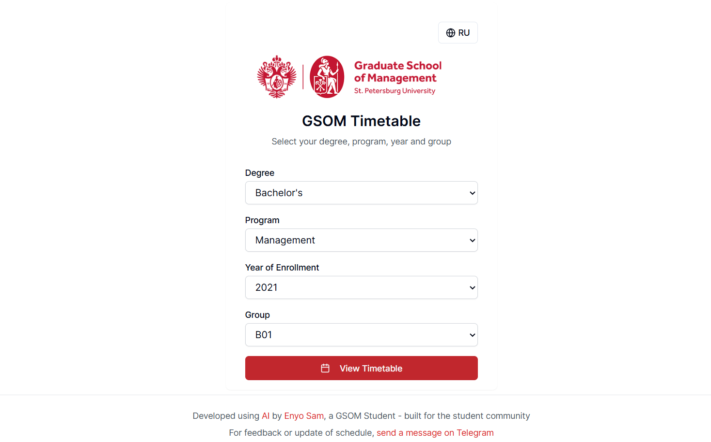

# GSOM Timetable

A modern, responsive web application for viewing class schedules at the Graduate School of Management (GSOM), St. Petersburg State University.

## Features

- 🌐 Bilingual support (English/Russian)
- 📱 Responsive design for all devices
- 🎓 Support for Bachelor's and Master's programs
- 📅 Comprehensive timetable view
- 🔍 Easy program, year, and group selection
- ⌨️ Command palette for quick navigation

## Technologies Used

- [Next.js](https://nextjs.org/) - React framework
- [TypeScript](https://www.typescriptlang.org/) - Type-safe JavaScript
- [Tailwind CSS](https://tailwindcss.com/) - Utility-first CSS framework
- [cmdk](https://cmdk.paco.me/) - Command palette component

## Getting Started

### Prerequisites

- Node.js 18+ or Bun
- npm, yarn, or bun

### Installation

1. Clone the repository:
   \`\`\`bash
   git clone https://github.com/yourusername/gsom-timetable.git
   cd gsom-timetable
   \`\`\`

2. Install dependencies:
   \`\`\`bash
   npm install
   # or
   yarn install
   # or
   bun install
   \`\`\`

3. Run the development server:
   \`\`\`bash
   npm run dev
   # or
   yarn dev
   # or
   bun dev
   \`\`\`

4. Open [http://localhost:3000](http://localhost:3000) in your browser to see the application.

## Data Format

Timetable data is stored in text files in the `public/data/` directory. The naming convention is:

- English: `schedule-YY-bXX.txt` or `schedule-YY-mXX.txt`
- Russian: `ru-schedule-YY-bXX.txt` or `ru-schedule-YY-mXX.txt`

Where:
- `YY` is the last two digits of the enrollment year (e.g., 21 for 2021)
- `bXX` is the bachelor group number (e.g., b01)
- `mXX` is the master group number (e.g., m01)

Each file follows this format:
\`\`\`
Day of week|Start time|End time|Course name|Professor|Room|Class type|Date
\`\`\`

Example:
\`\`\`
Monday|09:00|10:30|Corporate Finance|John Smith|Room 123|Lecture|2023-09-01
\`\`\`

## Deployment

The application can be easily deployed to Vercel:

## Contributing

Contributions are welcome! Please feel free to submit a Pull Request.

1. Fork the repository
2. Create your feature branch (`git checkout -b feature/amazing-feature`)
3. Commit your changes (`git commit -m 'Add some amazing feature'`)
4. Push to the branch (`git push origin feature/amazing-feature`)
5. Open a Pull Request

## License

This project is licensed under the MIT License - see the LICENSE file for details.

## NB
I built this Timetable is support of student and donated to Graduate School of Management, St. Petersburg State University
